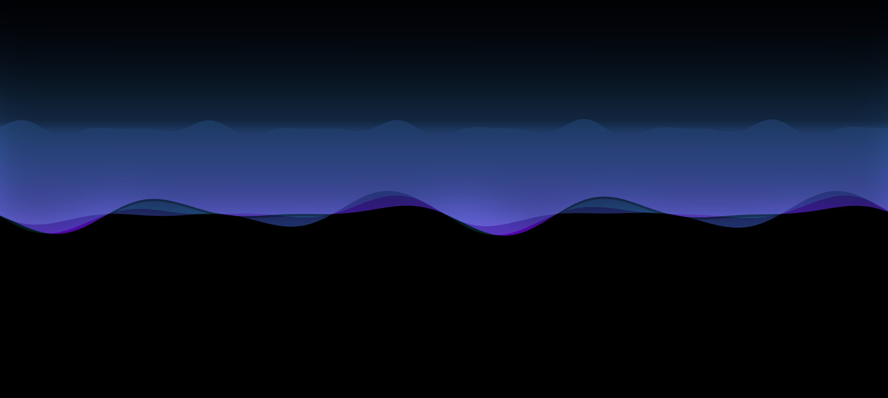

# Nebula Sandbox

## Table of Contents
* [Description](#description)
* [Usage](#usage)
* [Contributions](#contributions)
* [Questions](#questions)

## Description
Nebula Sandbox consists of two main components which use vector animations to emulate a 2D nebula. There is an optional third component to include stars which can be commented in via the App.jsx.

## Usage
To view the application locally, run 'npm i' then run 'npm run dev'.

## Questions
Follow me on [Github](https://github.com/Kayvonk).

To contact me, send an email to kayvonk@gmail.com with your name and inquiry.

Deployed Application: https://alternate-nebula.onrender.com/